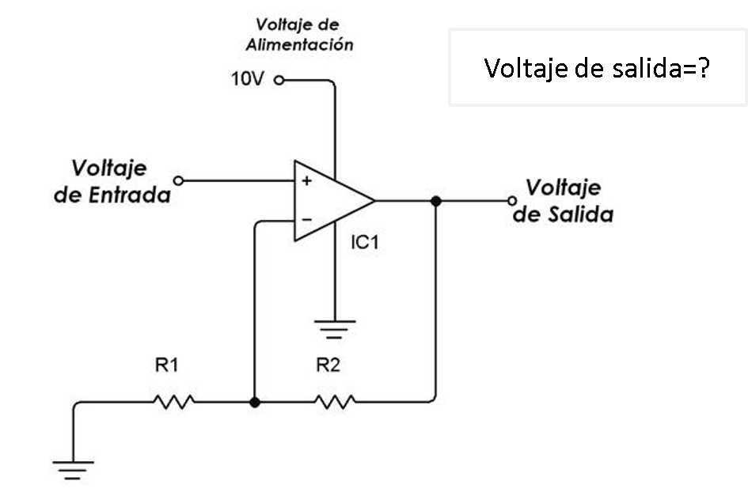
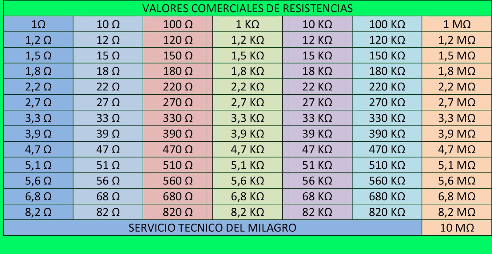

# Sensores
## :trophy: C1.4 Reto en clase

Circuito electrónico para el acondicionamiento de señal con un amplificador operacional

### :blue_book: Instrucciones

___

- De acuerdo con la información presentada por el asesor referente al tema acondicionadores de señal, contestar lo que se indica dentro del apartado desarrollo.

- Toda actividad o reto se deberá realizar utilizando el estilo **MarkDown con extension .md** y el entorno de desarrollo VSCode, debiendo ser elaborado como un documento **single page**, es decir si el documento cuanta con imágenes, enlaces o cualquier documento externo debe ser accedido desde etiquetas y enlaces.
- Es requisito que el archivo .md contenga una etiqueta del enlace al repositorio de su documento en Github, por ejemplo **Enlace a mi GitHub**
- Al concluir el reto el reto se deberá subir a github el archivo .md creado.
- Desde el archivo **.md** se debe exportar un archivo **.pdf** con la nomenclatura **C1.4_NombreAlumno_Equipo.pdf**, el cual deberá subirse a classroom dentro de su apartado correspondiente, para que sirva como evidencia de su entrega; siendo esta plataforma **oficial** aquí se recibirá la calificación de su actividad por individual.
- Considerando que el archivo .pdf, fue obtenido desde archivo .md, ambos deben ser idénticos y mostrar el mismo contenido.
- Su repositorio ademas de que debe contar con un archivo **readme**.md dentro de su directorio raíz, con la información como datos del estudiante, equipo de trabajo, materia, carrera, datos del asesor, e incluso logotipo o imágenes, debe tener un apartado de contenidos o indice, los cuales realmente son ligas o **enlaces a sus documentos .md**, _evite utilizar texto_ para indicar enlaces internos o externo.
- Se propone una estructura tal como esta indicada abajo, sin embargo puede utilizarse cualquier otra que le apoye para organizar su repositorio.

```  
| readme.md
| | blog
| | | C0.1_x.md
| | | C0.2_x.md
| | | C0.3_x.md
| | img
| | docs
| | | A0.1_x.md
| | | A0.2_x.md
```


## :pencil2: Desarrollo

___

**Problema a resolver:**

1. Calcular el valor de R1 y R2 que se requiere, para obtener una voltaje de salida de 3.3v, dado que el Voltaje de entrada es de 2.5v? Explique el procedimiento utilizado para realizar el calculo y considere valores comerciales para las resistencias que se considere utilizar.



### Primero se utiliza la formula mostrada en clase:

Vout = Vin (1 + R2/R1)

### Sustituimos los valores en la formula

3.3v = 2.5v (1 + R2/R1)

### Realizamos el despeje de R2/R1

3.3v/2.5v = 1 + R2/R1

1.32 = 1 + R2/R1

1.32 -1 = R2/R1

0.32 = R2/R1

### Con la formula despejada asignaré  valores a las resistencias tomando en cuenta la tabla de resistencias mas comerciales en el mercado

## Resistencias comerciales mas comunes


### En este caso utiliza un de 2.2 kohms ya que es un resistencia que he utilizado muchas veces a lo largo de la carrera.

0.32 = R2/2200ohm

R2 = 720 ohms 

### El resultado de R2 fue 720 pero ese valor no esta en la tabla de resistencias comerciales por lo que se tendra que hacer un arreglo de resistencias, en este caso con una de 390 y otra de 330 para poder obtener los 720 ohms.

R2 = (390 + 330) ohms

### Finalmente hay que sustituir los valores en la formula inicial para corroborar que el voltaje de salida es el esperado


Vout = 2.5v (1 + 720ohm/2200ohm)

Vout = 2.5v (1 + 0.327)

Vout = 2.5v (1.327)

Vout = 3.3175 V

### Por lo que los valores de R1 y R2 son:

R1= 2200 ohms
R2= 720 ohms

### Resolvi el ejercicio con 3 decimales para hacerlo un poco mas exacto lo cual hace que varie un poco el resultado, pero esta variación es minima
___

### :bomb: Rubrica

| Criterios     | Descripción                                                                                  | Puntaje |
| ------------- | -------------------------------------------------------------------------------------------- | ------- |
| Instrucciones | Se cumple con cada uno de los puntos indicados dentro del apartado Instrucciones?            | 20 |
| Desarrollo    | Se respondió a cada uno de los puntos solicitados dentro del desarrollo de la actividad?     | 80      |

:house: [Ir a Repositorio](https://github.com/HectorJaramillo/JaramilloHector-SistemasProgramables)